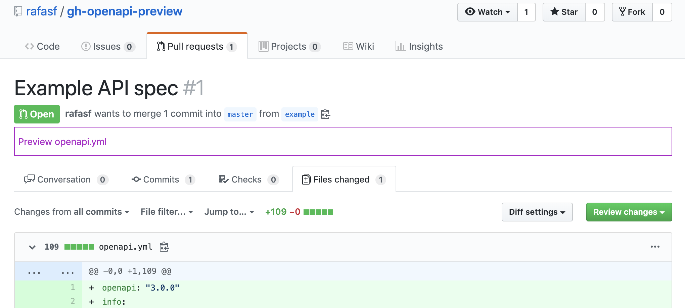

# GitHub OpenAPI Preview

If you are browsing API specs in a GitHub repository or looking at a pull
request which contains one, you will be get a link to preview it through ReDoc
in a new tab. :smile:

## What does it look for?

Files named `openapi.{yaml,yml}` and `swagger.{yaml.yml}`.

## Usage

1. Clone the repository
2. Enable "developer mode" in Chrome Extensions
3. Load unpacked, and select this directory

## Be Aware

After switching tabs in a pull request, you will need to refresh the page for
the extension to identify the files present.

## What do you see?

After installing the extension, go to a [pull request that has a OpenAPI spec](https://github.com/rafasf/gh-openapi-preview/pull/1/files) and you will see the following:

